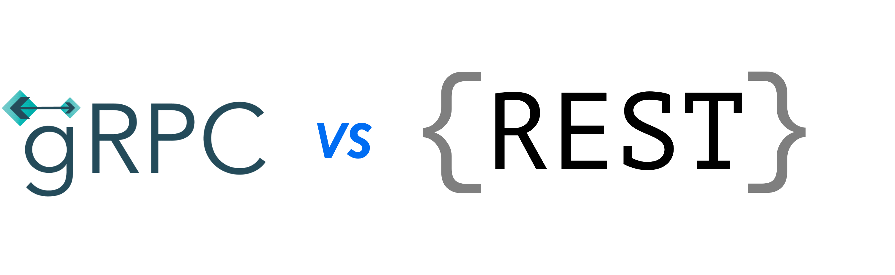

# Why we chose gRPC over REST for Multy

Nowadays, REST is ubiquitous across most kinds of applications. 
It provides an easy, simple and clear language to communicate between services, usually a frontend and a backend.
Although, there are many good alternatives and I want to talk about one in particular - gRPC.

From my days as a Software Engineer at Google, I have grown quite fond of gRPC. 
Google uses it **everywhere**, from communicating between frontend and backend, to communicating with database servers to all kinds of microservices. It's the core communication framework that powers everything from the 8.5 billion Google searches per day the internal communication layer between each teams' microservices.

<div class="text--center">



</div>

In this blog post, we'll go deeper into what gRPC actually is and what its advantages are over REST.

<!--truncate-->

### What is gRPC?

gRPC is a communication protocol built on top of HTTP that uses protobuf as its communication language.
There are many different advantages and details about gRPC but I want to focus on its communication language - protobuf.

Protobuf files are the representation, or schema, of what will actually be transmitted across the wire - which is usually binary data but can also be textproto or even JSON.

A protobuf message is something like:

```protobuf
message User {
  int64 user_id = 1;
  string name = 2;
  NotificationPreferences notification_preferences = 3;
  
  message NotificationPreferences {
    bool opted_into_newsletter = 1;
    string email_address = 2;
  }
}
```
<small style={{float:'right'}}>Another example in our <a target="_blank" href="https://github.com/multycloud/multy/blob/main/api/proto/resourcespb/virtual_network.proto">repo</a></small><br/><br/>

It defines what the underlying data should look like, much like how a database schema defines what data can be inserted.

### So is gRPC just REST with schema?

Not quite. The great advantage of using gRPC, and therefore protobuf, is that you can immedieatly take advantage of static typing.
A code generator looks at the protobuf configuration and generates data structures for whatever language you're using.
These could be classes in Java or structs in GoLang, and they come with a lot of tooling to convert back and forth from different formats.

Extending on the prior example, services in gRPC in protobuf can be defined as such:

```protobuf
service UserService {
  rpc RegisterUser(User) returns (Empty)
}
```
<small style={{float:'right'}}>Another example in our <a target="_blank" href="https://github.com/multycloud/multy/blob/main/api/proto/multy_service.proto">repo</a></small><br/><br/>

Running protoc will generate all the underlying code to interact with the service. 
Implementing the service is then super easy (example are in Go, but work for any language):

```go
type Server struct {
    proto.UnimplementedMultyResourceServiceServer
}

func main() {
    lis, err := net.Listen("tcp", fmt.Sprintf("0.0.0.0:%d", port))
    if err != nil {
        log.Fatalf("failed to listen: %s", err)
    }   
    s := grpc.NewServer()
    proto.RegisterMultyResourceServiceServer(s, &Server{})
    if err := s.Serve(lis); err != nil {
        log.Fatalf("failed to serve: %s", err)
    }
}

func (s *Server) RegisterUser(ctx context.Context, request *User) (*Empty, error) {
	fmt.Printf("Registering user %s\n", request.Name)
}
```
<small style={{float:'right'}}>Another example in our <a target="_blank" href="https://github.com/multycloud/multy/blob/main/api/server.go#L49">repo</a></small><br/><br/>


And the client:
```go
conn, err := grpc.Dial(c.ServerEndpoint, grpc.WithTransportCredentials(insecure.NewCredentials()))
if err != nil {
	return err
}

client := proto.NewMultyResourceServiceClient(conn)
client.RegisterUser(&User{
	Name: "john", 
	NotificationPreferences: &NotificationPreferences{EmailAddress: "john@gmail.com"},
})
```
<small style={{float:'right'}}>Another example in our <a target="_blank" href="https://github.com/multycloud/terraform-provider-multy/blob/main/multy/resource_virtual_network.go#L56">repo</a></small><br/><br/>


And that's it! 

All your services will be static typed - you no longer need to be worried about typos in your JSON or renaming a field and forgetting to update some part of your codebase.


### Conclusion

If you're starting to implement a new server and were thinking of using REST, make sure to look at the alternatives.
Static typing allows you to catch bugs earlier and provides great autocompletion in modern IDEs.

At Multy, we are building an open-source infrastructure tool that makes it easy to deploy any cloud with the same infrastructure code. We are using gRPC in our [Engine](https://github.com/multycloud/multy) because it allows us to easily build robust clients in any language. An example of this is our [Terraform provider](https://github.com/multycloud/terraform-provider-multy) that is used to create Multy resources.

If you want to learn more about gRPC, have a look through our repositories and feel free to contribute!

For any questions, join us on the [Multy discord channel](https://discord.gg/rgaKXY4tCZ)!

Website: https://multy.dev <br/>
GitHub: https://github.com/multycloud

:::note

If you want to look at a real world example of gRPC, check the Multy repos:<br/>
Multy Engine (gRPC server) - [https://github.com/multycloud/multy](https://github.com/multycloud/multy)<br/>
Multy Terraform Provider (gRPC client) - [https://github.com/multycloud/terraform-provider-multy](https://github.com/multycloud/terraform-provider-multy).

Join the discussion on our [discord channel](https://discord.gg/rgaKXY4tCZ)!

:::
