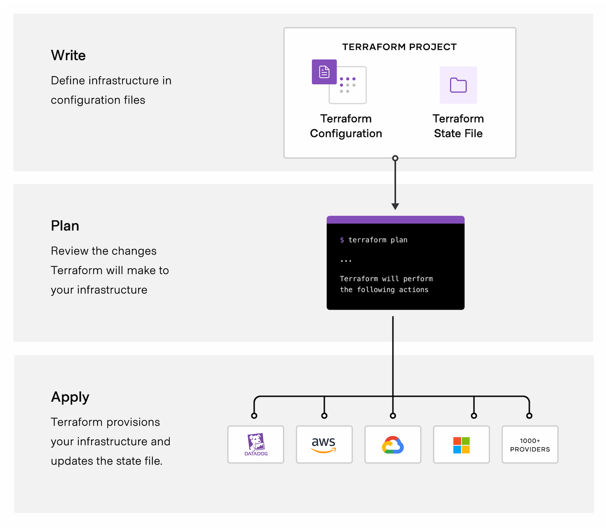

# Introduction to Infrastructure as Code

Cloud infrastructure has been on the rise for the last decade. As it's adoption grows, so has the complexity of managing infrastructure, becoming more complex and more prone to user mistakes. This led to a new wave of tools in the Infrastructure as Code (IaC) space that aim to tackle this issue by treating your infrastructure as you would any other piece of software. 

In this post, we'll go over an overview of what is IaC, why you should consider using it and a brief introduction to how some of these tools work under the hood.

<!--truncate-->

## What is IaC?

Infrastructure as Code is the practice of provisioning infrastructure in a declarative way, using code. This represents a shift from the imperative paradigm, where you manually deploy each resource, either by going through your cloud provider’s UI or by using a command line interface (CLI) and packaging these commands into bash scripts. 

The end goal of using IaC is to treat your infrastructure as you would any other piece of software so that you can minimize errors and improve collaboration.

:::note
Infrastructure as code isn’t necessarily declarative, but that’s the most common approach and how most IaC tools work 
:::

## Why you should consider IaC

Cloud computing is growing a lot, and the average user has increased the number of resources they use and that they have to manage. Provisioning infrastructure is quite dynamic nowadays - you need to scale up or down virtual machines, take down resources that are no longer being used or spin up temporary resources to run some experiments.

Without IaC in place, it can be hard to manage and account for every resource you are using. By using it, you can benefit from:

#### Self-service

By having everything in code, everyone can have an holistic view of what resources are being used and are empowered to change it as it’s needed. Changes can also be reviewed by the rest of the team to avoid any mistakes.

#### Idempotency

IaC tools are idempotent - meaning you can run the same script multiple times, and it leads to the same outcome. This is really important if something fails in the middle of the deployment - idempotency means you can just rerun the script and still end up with your desired outcome.

#### Configuration drift

Configuration drift is when the actual configuration of your infrastructure doesn't match what's declared in your code. This can happen for many reasons - someone changed something manually but forgot to change it back, some resource got killed for some reason, etc.
Your IaC tool will detect it and you can then change it back to what’s declared in your code. This becomes quite important if more than one person is making changes to the infrastructure.

#### Testing
Similarly to other parts of your software, testing can really minimize risk for any given change. For the critical parts of your application, it’s important to have automated testing.
Having your infrastructure in code allows you to write tests and be confident that nothing unexpected will break every time you change something.

## How IaC tools and Terraform work

A lot of tools have been developed in this space over the last few years. Each major cloud provider develops their own - AWS CloudFormation, Azure Resource Templates, Google Cloud Deployment Manager, etc - and there are some that work for multiple clouds - such as Terraform and Pulumi. The industry leader and the one we use at [Multy](https://multy.dev?ref=intro-iac) is Terraform. 

[Terraform](https://terraform.io/) is an open-source IaC tool that uses a declarative language (HCL) to deploy and manage infrastructure in hundreds of cloud providers, including AWS, Azure and GCP.  In this section we'll go over an high-level overview of how Terraform works and some examples as well.

### HCL language

Terraform developed their own domain-specific language (DSL) that is used to declare infrastructure configuration. Each resource is represented by a `resource` block, and you can reference other block’s properties similarly to as you would in a programming language. There's also handy builtin functions to process strings and other objects, loops to deploy and iterate over similar resources and modules to separate and reuse logic.

For example, this is how a Terraform file that declares a virtual network and a subnet in AWS looks like:

```hcl
resource "aws_vpc" "example_vn" {
  tags     = {
    "Name" = "vn"
  }

  cidr_block  = "10.0.0.0/16"
}

resource "aws_subnet" "example_subnet" {
  tags     = {
    "Name" = "subnet"
  }

  cidr_block = "10.0.1.0/24"
  vpc_id     = aws_vpc.example_vn.id
}
```

### State

Each declared resource that is specified in the configuration file is tracked in a state file (usually called *terraform.tfstate*). After Terraform finishes a deployment, the state contains the mapping between the declared resources names and the corresponding cloud provider resource ids. 

State also contains the current state of each resource - like the name and CIDR block in the example above - which is updated every time Terraform queries a cloud provider. It enables Terraform to catch any drift between the desired and the current configuration.

### Lifecycle

You can use Terraform through command line interface (CLI). There are 4 main commands available:

1. **Init** - Initializes the working directory and downloads all the providers necessary
2. **Plan** - Creates a plan that takes the current state to the desired state by creating, updating and deleting resources. No action is taken at this stage, the plan is used to check what will be changed if the `apply` stage is run.
3. **Apply** - Executes the plan ensuring the cloud provider configuration matches desired state
4. **Destroy** - Destroys every resource managed by Terraform



The 2 most important commands are `plan` and `apply`.

Running `terraform plan` will go through these steps:

1. Query the cloud provider for the current state of every resource and update the state file
2. Look for diffs between the state file and the declared configuration
3. Suggest a plan to create, update or delete resources so that the state matches the declared configuration

Running `terraform apply` will execute the plan and ensure that the actual cloud provider state matches the desired configuration, updating the state file after it succeeds.


## Conclusion

IaC tools offer a lot of benefits when compared to manually provisioning infrastructure - code can be tested, reviewed and version controlled. A lot of organizations are adopting it so they can minimize risk when changing their infrastructure and to improve collaboration.

At [Multy](https://multy.dev?ref=intro-iac), we’re leveraging the power of IaC tools and taking it one step further. Our goal is to reduce cloud vendor lock-in and make multi-cloud deployments easy. Instead of interacting with different cloud-specific UIs, or duplicating your Terraform configuration, Multy allows you to write a **cloud-agnostic infrastructure that can be deployed anywhere**. If want to learn more, check out our [Getting Started](https://docs.multy.dev/getting-started) guide.