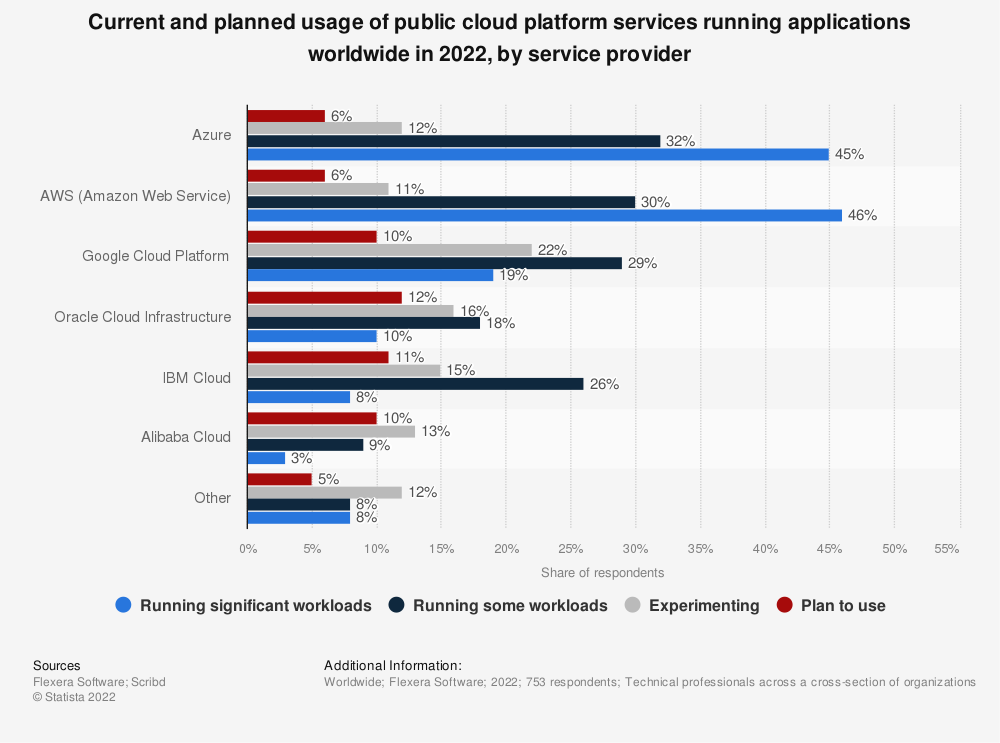

# Your Cloud Provider Will Fail You Eventually

Cloud has become the _de facto_ way to build infrastructure, meaning cloud providers end up in charge of a significant amount of the apps we use every day. From the likes of Netflix, Slack, Ring and Doordash running on AWS or PayPal, Twitter and HSBC on GCP, it's easy to see how impactful a failure of any type can be.

Let's look at some of the issues that have happened recently that have led business to consider how dependent they are on a single provider.

<!--truncate-->

## Outages

Nowadays, when a cloud provider has an outage, the world tends to notice. Here is some data around cloud usage today:

Outages can happen at any time and a number of different reasons. 

Let's look at some recent examples of outages:
- **Google and Oracle** ([link](https://www.theregister.com/2022/07/19/google_oracle_cloud/)): Due to cooling issues during the UK heatwave, hardware had to be shutdown to prevent the equipment from breaking. This meant outages of 22 hours for Oracle and close to 40 hours from Google, experiencing service unavailability across the UK regions. 

- **AWS**: AWS is no stranger to outages, and when that happens, they drag large parts of the internet [down with them](https://www.techradar.com/news/aws-is-down-and-taken-whole-chunks-of-the-internet-with-it). In December 2021 alone, AWS went down [3 times](https://www.zdnet.com/article/aws-suffers-third-outage-of-the-month/), bringing down apps such as Slack, McDonalds app and Epic Games Store.

When operating at such scale, outages are an inevitability. As a business, it's important to think about what is the acceptable risk and consider what can be done to mitigate, either from implementing multi-region solutions or adopting multi-cloud.

## Availability

Alongside outages, you also need to consider other forms of unavailability.

Cloud providers build regions based on demand. They are a massive capital investment that takes time to be operational. This means that you might be surprised to learn that a region is not available where you need it. This is especially prevalent when it comes to data residency laws. For instance, Switzerland is know for having very strict data privacy laws, meaning data often has to stay in the country. If you're an AWS customer, you might be surprised to learn that there is no region, meaning you might not be able to support customers there. 

Even if the region is exists, you then also need to ensure that the resources within that region are available. Over the last several months, Azure has been suffering from supply chain issues that led [core services to be unavailable](https://www.theregister.com/2022/07/04/azure_capacity_issues/). Virtual Machines and CosmosDB across the UK regions have not been available for deployment, with customer support recommending moving the infrastructure to another region entirely.

## Summary

At the end of the day, each business has to assess their tolerance to downtime (RTO) and data resilience (RPO). While some are willing to tolerate outages interruptions of service, others require near 100% availability with respect to uptime and data loss. Depending on the requirements, businesses should consider:

- **Single Region**: Understand the potential risks that come with building in a single provider/region and accept that the solution is not worth the investment.
- **Multi Region**: Building resilient infrastructure can help minimise some of the risks that come from failures in a single data center.
- **Multi Cloud**: Building in multiple clouds means that you can overcome the failures from one cloud by failing over to another provider. Read more about this shift in our [Why Companies Are Increasingly Going Multi-Cloud](http://localhost:3000/blog/benefits-of-multicloud) post.

Governments are realising the risks of being reliant on a single cloud provider and introducing legislation focused on ensuring that businesses have the necessary plans in place for proper resilience. Read our blog post on [cloud regulation](https://docs.multy.dev/blog/cloud-regulation-&-financial-services) to learn more.

At Multy we are enabling companies to more **easily deploy a multi-cloud infrastructure with our open-source tool that makes it easy to run on any cloud**. To learn more about Multy, have a look through our [documentation](https://docs.multy.dev/introduction) and [join our open beta](https://multy.dev/#beta). Continue the discussion in [our discord channel](https://discord.com/invite/rgaKXY4tCZ)!
