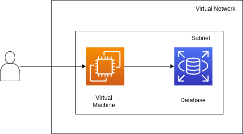

import Tabs from '@theme/Tabs';
import TabItem from '@theme/TabItem';

# Deploying a simple portable Web App in any cloud using Terraform and Multy

## Introduction

In this tutorial, we'll deploy a simple web app to the cloud of your choice - composed of a database and a virtual machine where the frontend code will run.
So that the configuration is reusable and consistent, we'll write it in [Terraform](https://terraform.io). 

Usually Terraform configurations are cloud-specific, and changing clouds requires a complete rewrite. In this case, so that you can reuse the same configuration across clouds, we'll be using [Multy](https://multy.dev?ref=web-app-demo-blog).

In-depth knowledge of Terraform and Multy is not needed to follow this tutorial. If you want to learn more about these tools, check out the [Multy documentation](https://docs.multy.dev/introduction) and the [Terraform documentation](https://www.terraform.io/docs). 

<!--truncate-->


## Architecture

This web app will contain the following components:

- Networking - a virtual network that can be accessed from the internet with the appropriate security group
- Database - a managed MySQL database where data will be stored 
- Virtual machine - a server configured to serve a simple notes app that stores and retrieves data from the database


<div class="text--center">

<div style={{display: 'block',marginLeft: 'auto',marginRight: 'auto',width: '70%'}}>



</div>

</div>

## Initializing Terraform

First, initialize Terraform. 
Here we'll set up the Multy provider and pass along any needed credentials.
Note that a Multy API key is needed - you can get it for free at https://multy.dev/#beta.

Additionally, we'll declare 2 variables, `cloud` and `location`, that make it easy to redeploy the web app in different clouds and locations. You'll need to generate some cloud credentials if you don't have them already - check out the [Getting Started](https://docs.multy.dev/getting-started) guide.


To set up the providers, open a `providers.tf` file with the following content:

```hcl
terraform {
  required_providers {
    multy = {
      source = "multycloud/multy"
    }
  }
}

provider "multy" {
  api_key = "xxx"
  aws     = {}
}

variable "cloud" {
  type    = string
  default = "aws"
}

variable "location" {
  type    = string
  default = "eu_west_1"
}

```

After, run the following command in the same folder:

```bash
terraform init
```

This command will download the [Multy provider](https://registry.terraform.io/providers/multycloud/multy/latest/docs) and initialize everything Terraform needs into a `.terraform` folder.

## Configuring networking

In order for the web app to be accessible from outside the cloud, we'll need to create a virtual network with the appropriate route table.

We need:
- A virtual network and a subnet
- A security group that opens up port 22 (for SSH access) and port 4000 (so that the website is accessible) as well as HTTP and HTTPS access to download the code and linux packages
- A route table that routes all traffic to the Internet

While this is quite different in each cloud, with Multy we can describe it in a cloud-agnostic manner:

```hcl
resource "multy_virtual_network" "vn" {
  cloud      = var.cloud
  location   = var.location

  name       = "multy-vm"
  cidr_block = "10.0.0.0/16"
}

resource "multy_subnet" "subnet" {
  name               = "multy-subnet"
  cidr_block         = "10.0.10.0/24"
  virtual_network_id = multy_virtual_network.vn.id
}

resource "multy_network_security_group" "nsg" {
  cloud              = var.cloud
  location           = var.location
  
  name               = "multy_nsg"
  virtual_network_id = multy_virtual_network.vn.id

  rule {
    protocol   = "tcp"
    priority   = 133
    from_port  = 443
    to_port    = 443
    cidr_block = "0.0.0.0/0"
    direction  = "egress"
  }
  rule {
    protocol   = "tcp"
    priority   = 131
    from_port  = 80
    to_port    = 80
    cidr_block = "0.0.0.0/0"
    direction  = "egress"
  }
  rule {
    protocol   = "tcp"
    priority   = 132
    from_port  = 4000
    to_port    = 4000
    cidr_block = "0.0.0.0/0"
    direction  = "ingress"
  }
  rule {
    protocol   = "tcp"
    priority   = 130
    from_port  = 22
    to_port    = 22
    cidr_block = "0.0.0.0/0"
    direction  = "ingress"
  }
}

resource "multy_route_table" "rt" {
  name               = "multy-rt"
  virtual_network_id = multy_virtual_network.vn.id
  route {
    cidr_block  = "0.0.0.0/0"
    destination = "internet"
  }
}

resource "multy_route_table_association" "rta" {
  route_table_id = multy_route_table.rt.id
  subnet_id      = multy_subnet.subnet.id
}

```

## Configuring database

Next up, we need to configure our database. We want a small MySQL database with a random password in the same location where we placed our virtual network.

```hcl
resource "random_password" "password" {
  length = 16
  override_special = "!#"
  special = true
}

resource "multy_database" "db" {
  cloud          = var.cloud
  location       = var.location
  
  storage_gb     = 10
  name           = "multydb"
  engine         = "mysql"
  engine_version = "5.7"
  username       = "multyadmin"
  password       = random_password.password.result
  size           = "micro"
  subnet_id      = multy_subnet.subnet.id


  depends_on = [multy_route_table_association.rta]
}
```


## Configuring a virtual machine

Finally, we need to configure the server. For this demo, we'll use the smallest server we can use. To initialize it, we'll make use of user data, a script that is executed by `cloud-init` when the virtual machine first boots.

```hcl
resource "multy_virtual_machine" "vm" {
  cloud          = var.cloud
  location       = var.location
  
  name               = "web_app_vm"
  size               = "general_micro"
  image_reference    = {
    os      = "ubuntu"
    version = "18.04"
  }
  subnet_id          = multy_subnet.subnet.id
  generate_public_ip = true
  user_data_base64   = base64encode(local.init_script)
  # uncomment this line to allow ssh access
  # public_ssh_key = file("~/.ssh/id_rsa.pub")
  
  network_security_group_ids = [multy_network_security_group.nsg.id]
}

locals {
  init_script = <<EOT
#!/bin/bash -xe
sudo apt-get update -y && sudo apt-get -y install git npm mysql-client curl jq
curl -fsSL https://deb.nodesource.com/setup_16.x | sudo -E bash -
sudo apt-get install -y nodejs
sudo chmod a+rwx .

# putting secrets into user data is not best practice, you can use multy_vault instead
export DATABASE_HOST=${multy_database.db.hostname}
export DATABASE_USER=${multy_database.db.connection_username}
export DATABASE_PASSWORD='${multy_database.db.password}'

git clone https://github.com/FaztTech/nodejs-mysql-links.git
cd nodejs-mysql-links

mysql -h $DATABASE_HOST -P 3306 -u $DATABASE_USER --password=$DATABASE_PASSWORD -e 'source database/db.sql' || true

npm i && npm run build && npm start
EOT
}

output "endpoint" {
  value = "http://${multy_virtual_machine.vm.public_ip}:4000"
}
```

## Deploying

After you have everything written, you can deploy the resources using Terraform. Run the following command, using the cloud and [location](https://docs.multy.dev/regions) you prefer:

```bash
terraform apply -var="cloud=aws" -var="location=eu_west_1"
```

After a few minutes, you should see an endpoint where you can access the example app!

## Summary

Terraform is a very powerful tool that makes deployments repeatable using a single unified language (HCL) for any cloud. However, clouds are quite different from each other which means Terraform files look very different from cloud to cloud. In this tutorial we looked at an example on how to leverage Multy to make deployments portable across multiple cloud providers - by just changing a single `cloud` parameter. If you want to explore other examples further, take a look at [Multy examples](https://docs.multy.dev/examples/). 