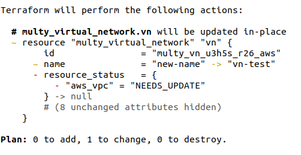
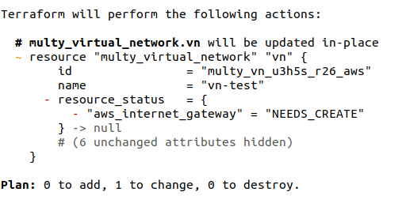

# Drift detection

Infrastrucure as code tools usually provide some way to ensure that the expected state (configuration) matches the actual infrastructure state - even if changes were made directly in the cloud providers. 

Every resource in Multy supports this drift detection. This means that if resources are changed or deleted outside Terraform or Multy, these changes are detected and Terraform state is updated accordingly.

### Example

For example, given the following virtual network configuration:

```hcl
resource "multy_virtual_network" "vn" {
  cloud    = "aws"

  name       = "vn-test"
  cidr_block = "10.0.0.0/16"
  location   = "eu_west_1"
}
```

If you change the virtual network name, by using the CLI or the AWS console, your expected state is then different from your actual state. Next time you run `terraform plan`, Multy will query the deployed resources and detect any changes, and you'll see the following output:



## Resource status

Not all attributes of the cloud resource are exposed as an attribute in the Multy resource. Also, a Multy resource can map to more than 1 cloud resource. In these cases, to notify the user of any drift, we use a different attribute - Resource Status.

Resource Status is an attribute that tells you when the underlying cloud resource is not in the expected state. It is a map where the key is a string that represents the underlying cloud resource (e.g. `aws_vpc`, `gcp_compute_network`) and the value can be one of:

- NEEDS_UPDATE - Underlying resource has been changed and can be updated in place
- NEEDS_CREATE - Underlying resource has been deleted, and so needs to be created
- NEEDS_RECREATE - Underlying resource has been changed and needs to be recreated to match the expected state


### Example

For example, given the following virtual network configuration:

```hcl
resource "multy_virtual_network" "vn" {
  cloud    = "aws"

  name       = "vn-test"
  cidr_block = "10.0.0.0/16"
  location   = "eu_west_1"
}
```

Virtual networks in AWS always have an internet gateway when deployed with Multy.
If you delete the internet gateway, for example using the AWS console or CLI, the virtual network is no longer in the expected state.


Next time you run `terraform plan`, Multy will query the deployed resources and detect the deleted resource, and you'll see the following output:



By running `terraform apply`, Multy will fix any inconsistencies and make sure your infrastructure matches the expected configuration.