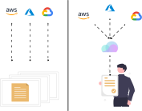

# Introduction

Multy is an platform that makes it easy to deploy the same infrastructure configuration on different clouds.

While tools such as [Terraform](https://www.terraform.io) are great for allowing users to deploy any resource in any cloud, they require infrastructure teams to know all the necessary providers inside-out.

As an example, let's say that a company has spent the last few years building out their infrastructure with AWS with Terraform. In order to avoid vendor lock-in, leverage a better deal (lower prices/credits) or increase resilience, they have decided to change their infrastructure in Azure. The [AWS](https://registry.terraform.io/providers/hashicorp/aws/latest/docs) and [Azure](https://registry.terraform.io/providers/hashicorp/azurerm/latest/docs) providers are not compatible, and this change essentially requires a full end-to-end rewrite.

This is changing with Multy. Instead of writing the same configuration for each provider, Multy offer a single cloud-agnostic API that handles the complexities behind the scenes to deploy your infrastructure on any cloud.

<!-- 

  

 -->

